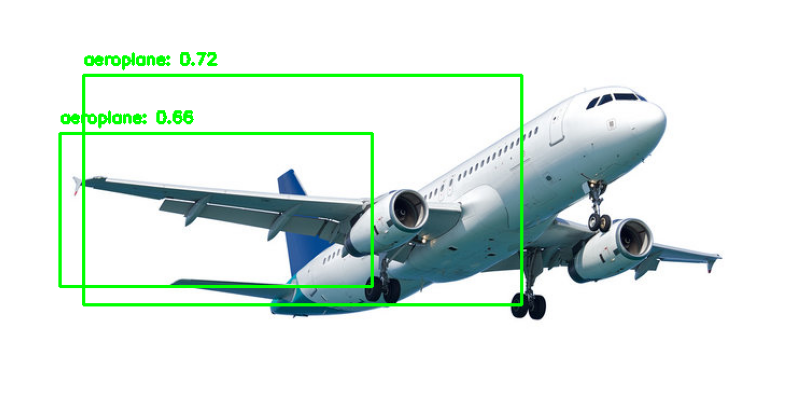

# Object Detection Model

Object detection project using Faster R-CNN with PyTorch and TorchVision.

The notebook covers:

- Pascal VOC dataset loading
- Faster R-CNN model setup
- Training
- Mean Average Precision evaluation
- Custom image inference
- Bounding-box visualization

## Tech Stack

- Python
- PyTorch
- TorchVision
- TorchMetrics
- OpenCV
- Matplotlib
- Google Colab

## Notebook

Open:

`Object_detection_model.ipynb`

## Sample Result

The model was tested on custom images and outputs predicted classes,
confidence scores and bounding boxes.

> Note: This is an experimental learning project. The training and
> evaluation pipeline will be improved further.
